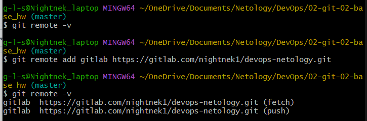
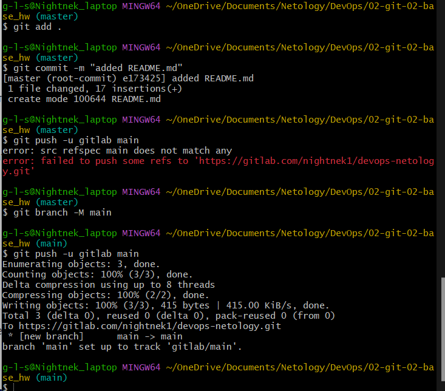

# 02-git-02-base_hw Домашнее задание к занятию «Основы Git»

## Задание 1. Знакомимся с GitLab и Bitbucket

### GitLab

### Bitbucket

## Задание 2. Теги

## Задание 3. Ветки

## Задание 4. Упрощаем себе жизнь